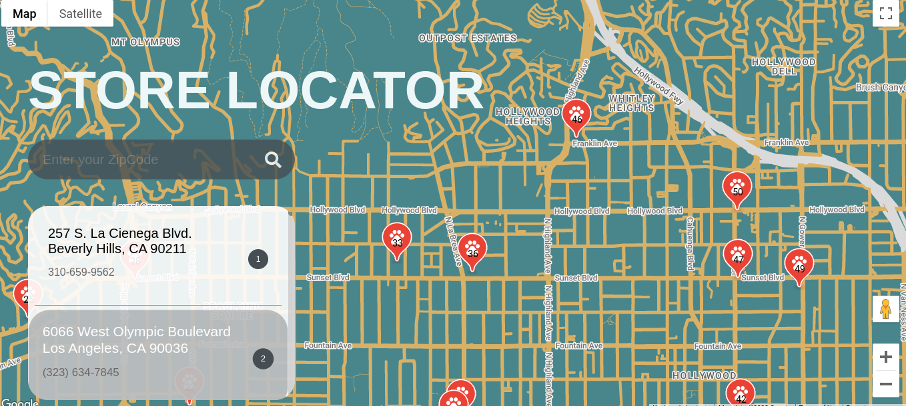

# Store Locator

A demo project for learning to use the Google Maps API. The user can filter the stores by zip code and click to zoom in to the store location. The maps are custom styled to dark mode.

Developed using HTML, CSS and JavaScript.

